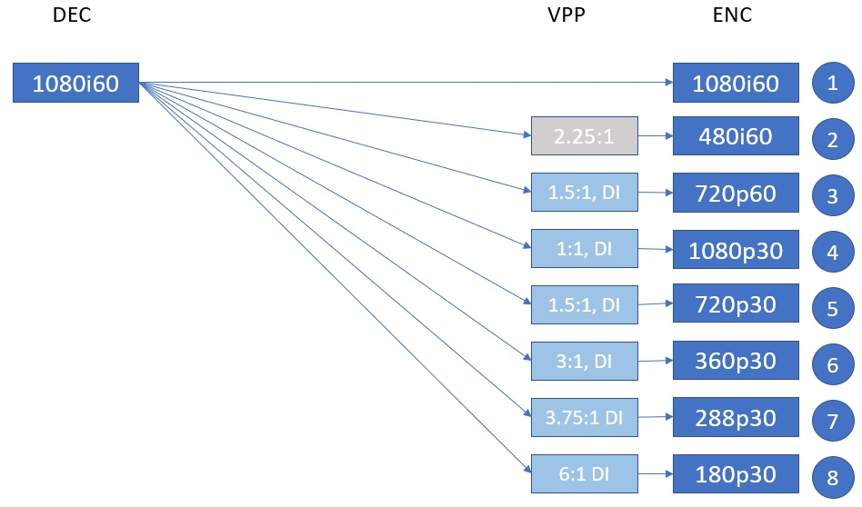
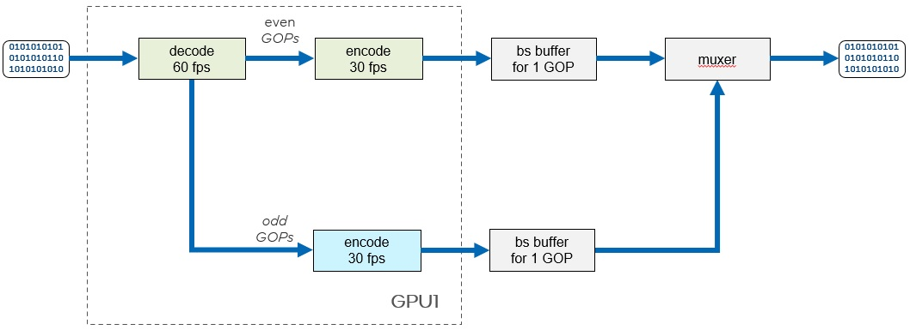
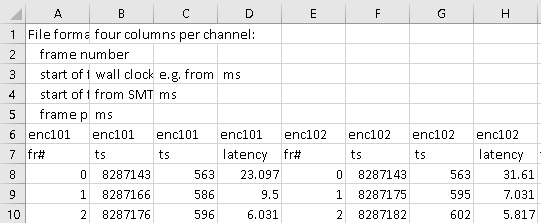
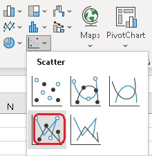
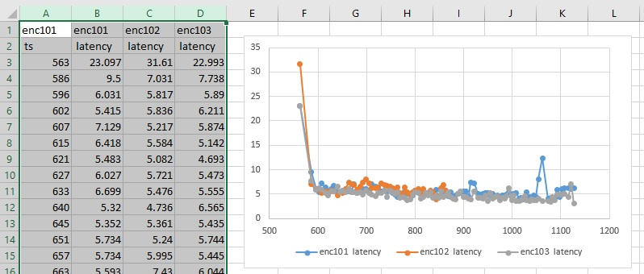

## Overview

This document describes how to configure and use SMT tracer for performance estimation and tuning. Tracer has been developed to tune complicated 1 to N transcoding pipelines, where one input stream is transcoded to several output streams with different resolutions, bitrates, and frame rates. It visualizes surface pool utilization, decode, VPP and encode task dependencies. It measures per frame End To End (E2E) and encoding (ENC) latencies.

This document starts with description of two performance tuning tools - cascade scaling and parallel encoding. Then it goes to general overview of tracer capabilities, then to E2E and ENC latencies tracing, and concludes by HOWTOs and known limitations.

## Cascade scaling

Some transcoding pipelines can greatly benefit from so called cascade scaling. SMT sample demonstrates how to implement and use cascade scaling. 

Let’s look at the transcoding case showed on the diagram below. Here one decoder feeds 8 encoders with different resolutions, frame rates and picture structures.


 

As can be seen, deinterlacing and downscaling from original HD resolution is performed 6 times. Because deinterlacing is slow operation and downscaling from original resolution consumes a lot of memory bandwidth, this pipeline may be bottlenecked by VPP performance. To remove this bottleneck cascade scaling may be used as shown on the next diagram.


 

Here, number of deinterlacing operations was reduce to two and just three downscaling operations are performed on original HD resolution. With growing number of channels and growing resolution ratio between decoder and encoder channels, benefits of cascade scaling will also grow.

To enable cascade scaling, new command line option was introduced “-cs”. It should be used in parameter file to define cascade scaling configuration. Adding this option to the channel description instructs sample to use output from the previous channel VPP instead of direct decoder output. Option is “sticky”. All subsequent channels specified in parameter file will use the same VPP output until new “-cs” option will be encountered. 

This is example of parameter file for the pipeline that is shown above.
```
-i::h264 in.h264 -async 3 -o::sink -join -trace
-i::source -join     -w 1920 -h 1080                                  -async 3 -b  8000 -o::h264 out101_di.264 
-i::source -join     -w  720 -h  480                                  -async 3 -b  4000 -o::h264 out102_di.264 
-i::source -join     -w 1280 -h  720 -FRC::PT -f 60 -deinterlace::ADI -async 3 -b  8000 -o::h264 out103_di.264 
-i::source -join -cs -w 1920 -h 1080 -FRC::PT -f 30 -deinterlace::ADI -async 3 -b  8000 -o::h264 out104_di.264
-i::source -join -cs -w 1280 -h  720                                  -async 3 -b  4000 -o::h264 out105_di.264 
-i::source -join -cs -w  640 -h  360                                  -async 3 -b  2000 -o::h264 out106_di.264
-i::source -join     -w  352 -h  288                                  -async 3 -b  1000 -o::h264 out107_di.264
-i::source -join     -w  240 -h  180                                  -async 3 -b  1000 -o::h264 out108_di.264
```


## Parallel encoding

Sometimes, e.g., for very high resolutions, transcoding couldn’t be handled by single decode / encode pair. For such use cases parallel transcoding has been developed. SMT supports two different parallel transcoding modes – so called 2x2, that distributes workload between different GPUs, and 1x2 that distributes workload between different HW units of the same GPU. In both cases parallelization is done on GOP level.

### 2x2 mode

Picture below shows pipeline configuration for 2x2 mode, numbers are for 60 fps transcoding case. This is the most powerful mode that can give up to 2x transcoding speed up. We use two GPUs here. Each one runs decode / encode pair. Because performance is usually limited by encoder, each GPU decodes all frames in input bitstream but encodes only half of them. That means that decoder runs at 60 fps, and encoder at 30 fps, reducing encoder workload twice in comparison to sequential transcoding. After two GOPs have been transcoded, we mux them back to single bitstream and write to file.


To run such pipeline, use this command line:
```
./sample_multi_transcode -par 2x2.par
```

and this par file:
```
-i::h265 in.h265 -device /dev/dri/renderD128 -async 30 -u 7 -dist 8 -gop_size 60 -idr_interval 1 -vbr -b 80000 -o::h265 res.h265  -parallel_encoding
-i::h265 in.h265 -device /dev/dri/renderD129 -async 30 -u 7 -dist 8 -gop_size 60 -idr_interval 1 -vbr -b 80000 -o::h265 null.h265
```

Note, that the only difference from conventional transcoding is presence of `-parallel_encoding` options in first line of par file.


Also note, that performance significantly depends on async depth value. It specifies buffer size between decoder and encoder. This buffer should be big enough to keep encoder busy while decoder skips irrelevant GOP. But at the same time, this buffer should be small enough not to cause local memory swapping, that will harm performance. This async depth value also impacts transcoding latency and sometimes it may be preferable to decrease this value and trade off performance for latency. Summing up, async depth can be used to tune performance / latency of parallel transcoding for different use cases. Good starting point is half of the GOP size.


### 1x2 mode

We use just one GPU here and performance gain comes from better distribution of workloads among available HW units of the same GPU. This mode gives much less performance gain in comparison to 2x2 mode. Depending on workload, it may be in 20-30% range. This mode uses one decoder that feeds two encoders. Each one encodes complete GOP. The rest of pipeline is similar to 2x2 mode.




To run such pipeline, use this command line:
```
./sample_multi_transcode -par 1x2.par
```

and this par file:
```
-i::h265 in.h265 -device /dev/dri/renderD128 -async 20 -o::sink -join -parallel_encoding
-i::source -join -async 20 -u 7 -dist 8 -gop_size 30 -idr_interval 1 -vbr -b 80000 -o::h265 res.h265
-i::source -join -async 20 -u 7 -dist 8 -gop_size 30 -idr_interval 1 -vbr -b 80000 -o::h265 null.h265
```

About async depth. Because everything runs on single GPU here, pressure on memory system is much higher in this mode and we recommend using smaller GOP sizes and bigger, relative to GOP size, async depth values. Good starting point is GOP 30 and async depth 20.


## Tracing
Cascade scaling performance strongly depends on HW capability, used VPP filters and input / output resolution ratio. To facilitate performance optimization, tracing capabilities were added to the sample. To enable tracing add “-trace” command line option to the par file, see parameter file example above. Then, after execution, trace file with unique name will be generated.

In this trace file surface pools utilization will be showed. Picture below is an example for the pipeline described in previous section.


 
Eight pools are shown – decoder, three pools for cascade scaling (VPP pools) and four encoder pools (for 2nd, 3rd, 7th and 8th channels). As can be seen, decoder pool is completely utilized,  encoder pool for 2nd, 7th and 8th channels have optimal utilization, high enough, but with some spare frames in reserve and cascade scaling pools for 4th, 5th and 6th channels are underutilized. Reducing number of surfaces in these pools will reduce memory footprint in this particular case.

This trace file will also show general execution flow as illustrated by next three pictures. They are also captured for the pipeline described in previous section. 


 

On this picture, from top to bottom. First line is decoding events, then three cascade scaling VPPs for 4th 5th and 6th channels, and then 8 encoders. In each channel task submission is shown, under “dec”, “csvpp”, “vpp” and “enc” names, “busy” wait, sync operation wait “syncp” and task dependencies (arrows). Note, that actual processing time (decoding, scaling or encoding) is not shown as a separate block on the diagram, but it can be deduced as a time interval between task submission and corresponded sync operation. Also note, that on high performance system duration of some events may be less than 1 microsecond. Such event is shown as zero duration event and its dependency may be incorrect. 

On this picture it can be clearly seen that third channel in this pipeline is the bottleneck. All channels except 3rd start VPP operation and encoding soon after decoding, 3rd channel only after several frames delay. It is also clearly visible from this traces that 3rd channel has two VPP and two encoder calls for each decoded frame, due to i60 to p60 frame rate conversion.


 

This is zoomed in area “1” of the previous picture. It shows relations between decoder, cascade scaling , VPPs and encoders in different channels. Note, that 1st channel depends only on decoder output, 2nd uses cascade scaler VPP but also runs its own VPP before encode, 4th uses cascade scaling output directly and so on.


 
This is zoomed-in area “2” of the previous picture. It shows sync point wait operations. Note, that all processing has been completed before this wait and wait finishes almost immediately for all channels. This is one more conformation that 3rd channel is the bottleneck in this case.

## E2E and ENC latencies

Depending on use case, we may need to tune pipeline for E2E or ENC latency. To facilitate this tuning, tracer measure these latencies and dumps them in *.csv file. Latencies are computed after transcoding is finished and this computation does not affect transcoding performance. That is why if tracer is enabled, it always computes and dumps latencies.

To measure E2E latency, we start timer just before MFXVideoDECODE_DecodeFrameAsync() call and stop it when MFXVideoCORE_SyncOperation() finishes wait for sync point returned from MFXVideoENCODE_EncodeFrameAsync() function. I.e., we measure latency from the moment we send bitstream to decoder till the moment we get bitstream from encoder. Note, that we don’t take into account auxiliary calls, like request for more bitstream data from decoder, because in this case we will also count time spent reading bitstream from disk. Picture below shows example of E2E latency measured for first encoder.


 
For ENC latency, we start timer just before MFXVideoENCODE_EncodeFrameAsync() call (very small blue rectangle on the picture below) and stop it just after MFXVideoCORE_SyncOperation() call (long green rectangle on the picture below). I.e., we measure pure encoding time, from the moment we send surface to encoding, till the moment we get encoded bitstream.


 
Important note. To correctly interpret measured latencies, we have to take into account frame reordering. If input or output bitstreams have reordered frames, then DecodeFrameAsync() may consume one frame as input, but return surface that corresponds to another frame as output. The same is true for encoder – it may consume one frame as input but return another as output in the same EncodeFrameAsync() call. That means that in this case E2E or ENC latencies don’t show timing for the same frame.

Another thing that we have to take into account during latency measurement is asynchronous nature of transcoding. Even for async depth equals 1, sample calls EncodeFrameAsync() before actual decoding is finished. That means that ENC latency includes not only encoding time but decoding also. To measure only encoding time use “-trace::ENC” command line option. This option adds additional synchronization point between decoder and encoder and ensures that encoder is called after decoding is finished and only encoding latency is measured. This is example of pipeline with “-trace::ENC” option.


 
Similar issue exists for E2E latency. Even for async depth equals 1, decoder starts decoding of next frame before encoding of previous frame is finished and as a result decoding workload overlaps with encoding one and decoding time may be measured incorrectly (decoder may finish earlier and wait for encoder to start). To avoid this, use “-trace::E2E” command line option. In this case decoder starts decoding of next frame only after encoding of previous one has been finished in all channels. This is example of “-trace::E2E” option.


  
Note, that both these options “-trace::E2E” and “-trace::ENC” affect pipeline and reduce throughput by introducing additional synchronization points. They should be used only to simulate specific use case, e.g., real-time streaming, when we start processing of next frame only after previous one has been encoded and sent out.

## HOWTOs

### How to find tracer output

Look at the very end of the SMT output in console. File names are unique for each run.


 

### How to choose tracer buffer size

Tracer buffer size is fixed to avoid dynamic memory allocation that impacts performance. If workload is big enough or unusually high number of events occur during transcoding, then tracer runs out of buffer. In this case tracing stops and only part of the trace is saved. That also affects latency calculation - only first frames will have latency measured.

SMT outputs buffer usage in console after transcoding. See picture above. If usage is 100%, look at the .csv file and check how many frames were captured, then increase buffer size accordingly. E.g., if 30% of the frames were capture, then triple buffer size. Use “-trace_buffer_size X” command line option.  Default buffer size is 7 MBytes. It is usually enough to capture 1000 frames in 1 to 8 transcoding pipeline. Maximum size is 127 Mbytes.

### How to view .json file

Open Google Chrome (TM). Type “chrome://tracing/” in address bar. Drag and drop .json file or click “Load” button and select .json file to view. Use “A”, “S”, “D”, “W” keys or mouse to navigate through traces.

### How to view .csv file

Open file, for example, using Microsoft(R) Excel(R).


 
First five lines are short description of file format. Then goes latency data. For each channel in 1 to N pipeline there are four columns. First one is frame number. Note, that channels may have different numbers of frames, e.g., due to frame rate conversion. Second column is time when processing of current frame started. It may be start of decoding or encoding depending on use case - E2E or ENC. This column shows so called “wall clock” time. It usually starts at the system boot time but depending on implementation it may be different moment of time. Third column is the same moment in time, but from different starting point. This one from SMT start. Looking at the first frame in this column we can estimate application initialization time. Last column is latency. All numbers are in milliseconds.

To plot latency chart, delete irrelevant columns and rows, then select data and click insert chart button.


 



 
To debug system wide behavior, we can combine several .csv files. To do so, leave wall clock and latency columns for required channels, then move them to the same file and plot the chart.

## Known limitations.

Tracer works only with par file.

Tracer supports only default (GENERAL_ALLOC) memory model.

All sessions used in transcoding should be joined, overwise event dependencies in trace may be shown incorrectly and some latencies may be computed incorrectly. Trace itself will still be correct.

